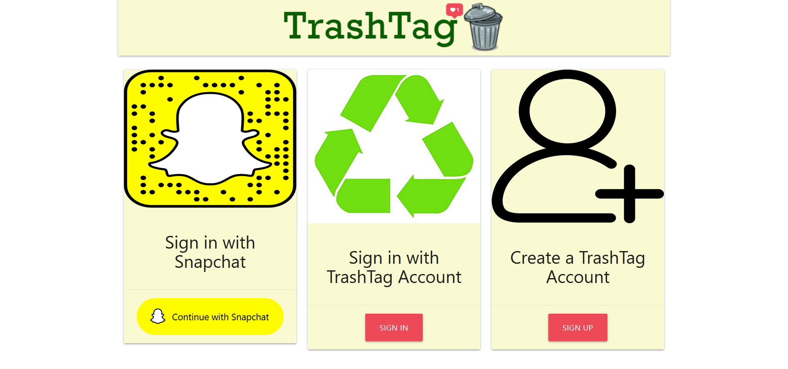
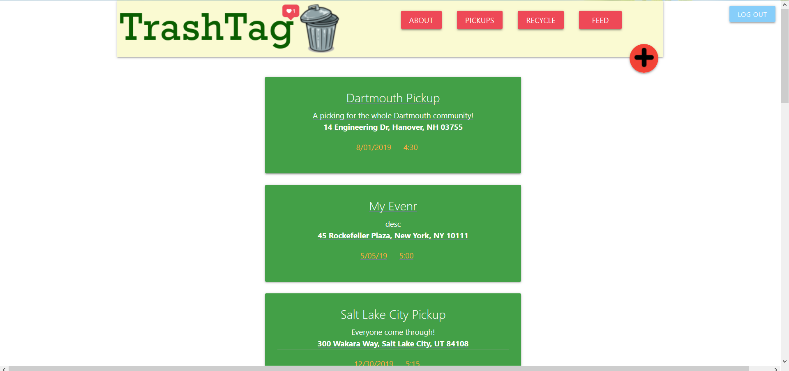
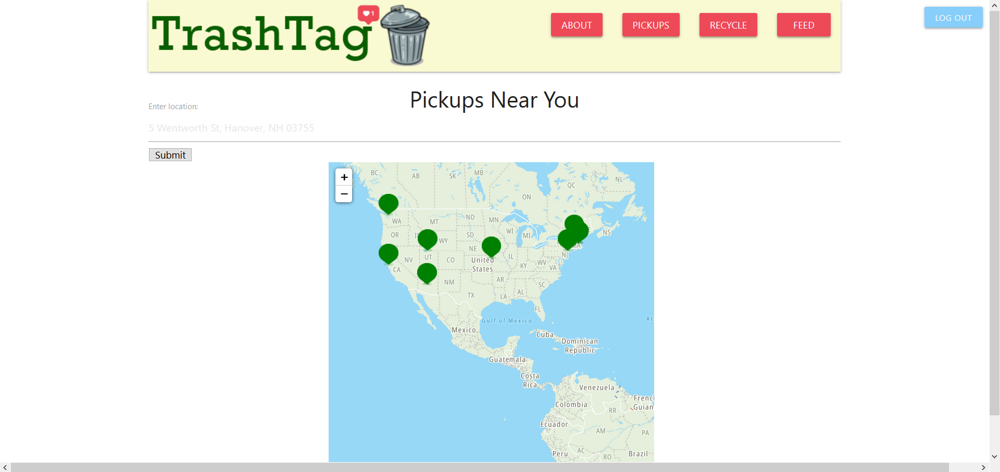
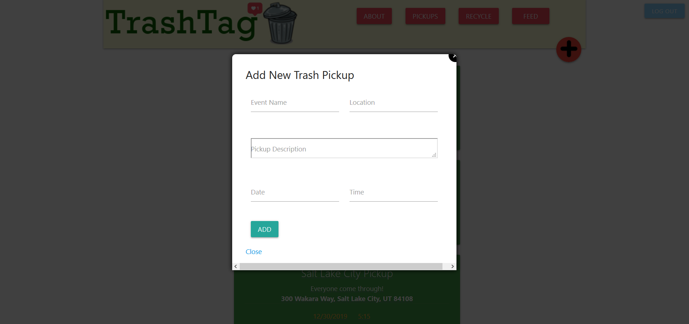

# Trashtag

TrashTag is a website that allows users to plan trash pickups in their community and get connected with ones planned by other like-minded individuals. We settled on this idea because we saw it as something that could benefit others (communities and the planet) and also be an ideal candidate for becoming a mobile app. And we had a catchy name.

This project won **Best Use of Snapchat** API at HackDartmouth 2019. There are no current plans for future development.

Developed using vanilla JavaScript/HTML/CSS with [Firebase](https://firebase.google.com/) backend for storing user and pickup data, [TomTom](https://www.tomtom.com/en_us/) API for maps, and [Snap Kit](https://kit.snapchat.com/) API for login.

